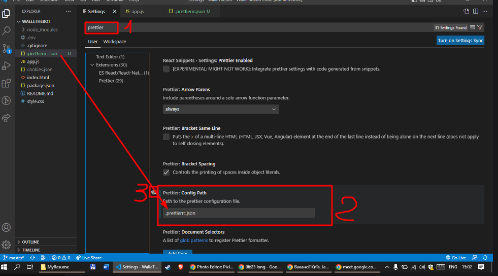

# Walle Bot

It's a bot for loocking vacancies

## How to start

### Clone the repository

```
git clone git@github.com:Alianshark/WalleTheBot.git
cd WalleTheBot
```

### Create `.env` file to set your pass

```
touch .env
```

### Add to .env file your djinni email and password

Example of .env file:

```
export email='your_email@gmail.com'
export password='your_pass'
```

> create account on [Djinni.co](Djinni.co) manualy

### Run the bot

```
npm install
npm start
```

After this the chrome-browser will run.

This comand will run from brouser and serch for vacansies.

## Code style formatter

In vs code settings set prettier config file to `.prettierrc.json`



## Development plan

- [x] install [https://pptr.dev/](https://pptr.dev/)
- [x] login to djinni.co
- [x] save coockies to file
- [x] login only if there is no coockies file
- [x] go to vacancies page, with filters
- [x] fill vacancy message input
- [x] click apply button
- [x] if already applied on vacancy do nothing
- [x] refactor code : splite `app.js` into multiple files
- [x] refactor code: splite into multiple function
- [x] save console output to `log.txt` file
- [x] check vacancy every 20 sec
- [x] apply more filters for searching vacancy
- [ ] add posibbility to apply on more than one vacancies
